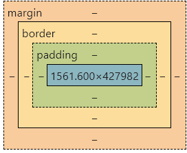
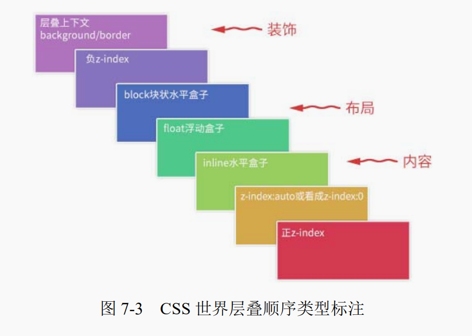
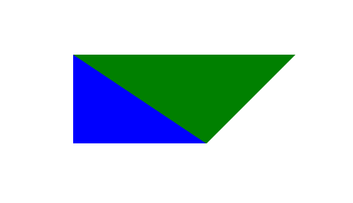

## CSS盒模型

> content-box ： content（元素内容） + padding（内边距） + border（边框） + margin（外边距）
> border-box ： 盒子宽度包含了padding（内边距） + border（边框）总宽度 = margin + width
> inherit： 继承父元素盒子的box-sizing属性

## BFC
块级格式化上下文，是一个独立的渲染区域，让处于 BFC 内部的元素与外部的元素相互隔离，使内外元素的定位不会相互影响。

触发的条件：
- 根元素
- 绝对定位元素 position:fixed 或 position:absolute
- 行内块inline-blocks(元素的 display: inline-block)
- overflow的值不为visible的元素。
- float不为none的元素 默认值位none
- 弹性盒子 display：flex的元素
- 表格单元格(元素的display: table-cell，HTML表格单元格默认属性。

创建BFC的场景：
- 外边距折叠
- 可以阻止元素被浮动元素覆盖 即创建BFC成为一个独立的元素与外部元素隔离

## 元素层叠顺序



## 选择器权重
- 属性后面加!import会覆盖页面内任何位置定义的元素样式
- 作为style属性写在元素内的样式
- id选择器
- 类选择器
- 标签选择器
- 通配符选择器（*）

## CSS 三角形

```CSS
.triangle{
    width: 0;
    border-width: 10px 20px;
    border-style: solid;
    border-color: #000 transparent transparent transparent; /*倒三角*/
}
.triangle{
    width: 0;
    border-width: 10px 20px;
    border-style: solid;
    border-color: transparent #000 transparent transparent; /*右三角*/
}
.triangle{
    width: 0;
    border-width: 10px 20px;
    border-style: solid;
    border-color: transparent transparent #000 transparent; /*正三角*/
}
.triangle{
    width: 0;
    border-width: 10px 20px;
    border-style: solid;
    border-color: transparent transparent transparent #000; /*左三角*/
}
```
## 用CSS的clip-path实现不规则矩形
**利用clip-path**
```CSS
.discount-btn{
    width:129px;
    height:48px;
    background: linear-gradient(90deg, #ffa25e 0%, #fd6930 100%);
    clip-path: polygon(0 0,100% 0%,75% 100%,0% 100%); // 上 x,y 右 x,y 下 x,y 左 x,y
}
```
[clip-path](https://developer.mozilla.org/zh-CN/docs/Web/CSS/clip-path)
> polygon
> 每一对在列表中的参数都代表了多边形顶点的坐标， xi 与 yi ，i代表顶点的编号，即，第i个顶点

**实现效果：**


**利用border属性**
```CSS
div {
  width:0;
  border-top:100px solid green;
  border-left:150px solid blue;
  border-right:100px solid transparent;
}
```
**实现效果：**



> 缺点：颜色无法渐变

## CSS实现立体圆柱

```CSS
.yuanzhu {
    position: relative;
    height: 54px;
    width: 230px;
    margin-top: 30px;
    background: linear-gradient(180deg, #ffeab4 0%, #fff1d1 27%, #f8bb58 100%);
    margin: 30px auto;
    border-top-left-radius: 15px;
    border-bottom-left-radius: 15px;
  }

  .yuanzhu::after {
    position: absolute;
    right: -10px;
    content: '';
    display: block;
    width: 20px;
    height: 54px;
    border-radius: 50%;
    background: linear-gradient(180deg, #fcc35c 0%, #ab710e 100%);
  }
```
**实现效果：**


## 重绘和重排

- 重绘：当渲染树的元素外观（如颜色）发生改变，不影响布局时，产生重绘
- 重排：当渲染树的元素的布局（如位置，尺寸，隐藏/显示）发生改变时，产生重排
- 注意：JS获取Layout属性值（如：offsetLeft、scrollTop、getComputedStyle等）也会引起重排。因为浏览器需要通过重排计算最新值
- 重排必定产生重绘，但重绘不一定引起重排

**如何最小化重绘(repaint)和重排(reflow)**：

- 需要要对元素进行复杂的操作时，可以先隐藏(display:"none")，操作完成后再显示
- 需要创建多个DOM节点时，使用DocumentFragment创建完后一次性的加入document
- 缓存Layout属性值，如：var left = elem.offsetLeft; 这样，多次使用 left 只产生一次重排
- 尽量避免用table布局（table元素一旦触发重排就会导致table里所有的其它元素重排）
- 避免使用css表达式(expression)，因为每次调用都会重新计算值（包括加载页面）
- 尽量使用 css 属性简写，如：用 border 代替 border-width, border-style, border-color
- 批量修改元素样式：elem.className 和 elem.style.cssText 代替 elem.style.xxx
