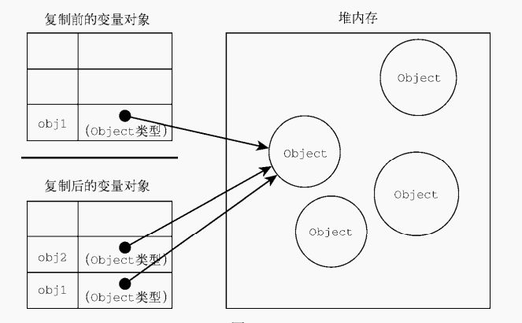

## 实现浅拷贝
**首先认识一下什么是拷贝？**
```js
let arr = [1,2,3]
let newArr = arr
newArr[0] = 13
console.log(arr);//[100, 2, 3]
```
> 这是直接赋值不涉及任何拷贝，由于进行赋值操作的是数组，而数组在javaScript中是引用值，当把引用值从一个变量赋给另一个变量时，存储在变量中的值也会被复制到新变量所在的位置。与原始值的区别在于，这里面复制的是指向变量存储位置（堆内存）的指针（地址）。实际两个变量指向的是一个地址也就是同一变量

如图：


现在进行浅拷贝
```js
let arr = [1, 2, 3];
let newArr = arr.slice();
newArr[0] = 100;

console.log(arr);//[1, 2, 3]
```
当修改newArr的时候，arr的值并不改变。什么原因?因为这里newArr是arr浅拷贝后的结果，newArr和arr现在引用的已经不是同一块空间啦！

```js
let arr = [1, 2, {val: 4}];
let newArr = arr.slice();
newArr[2].val = 1000;

console.log(arr);//[ 1, 2, { val: 1000 } ]
```
但如果改变的是引用值（数组、对象）,浅拷贝只能拷贝一层对象

弄清楚浅拷贝那么现在来实现浅拷贝：
```js
const shallowClone = (target) => {
    if(typeof target === 'object' && target !== null){
        const cloneTarget = Array.isArray(target) ? [] : {}
        for(let key in target){
            if(target.hasOwnProperty(key)){
                cloneTarget[key] = target[key];
            }
        }
         return cloneTarget;
    }else{
        return target
    }
}
```
除了自己造轮子外，slice、...展开运算符、concat、Object.assign这些常见的api拷贝的都是对象的属性的引用，而不是对象本身都是属于浅拷贝

## 实现深拷贝

> 考察点：递归

```js
function isObject(obj){
    return typeof obj === 'object'
}
function deepClone(obj){
    if(!obj || !isObject(obj)) return obj
    const cloneTarget = Array.isArray(obj) ? [] : {}
    for(let key in obj){
        if(obj.hasOwnProperty(key)){
             cloneTarget[key] = isObject(obj[key]) ? deepClone(obj[key]) : obj[key];
        }
    }
    return cloneTarget

}
```
这是简单版本，还不够完善，但已经能覆盖大多数应用场景。

但如果有以下的应用场景，则还需优化，现在来一步一步优化我们的代码：
1、无法解决循环引用的问题
2、无法拷贝一些特殊的对象，诸如 RegExp, Date, Set, Map等
3、无法拷贝函数(划重点)。
### 循环引用
举个例子：
```js
const obj = {val:2};
obj.target = obj;
deepClone(obj);//报错: RangeError: Maximum call stack size exceeded
```
拷贝obj会出现系统栈溢出，因为出现了无限递归的情况。

如何解决？是不是只要在递归前判断这个对象是否拷贝过，那么记录下已经拷贝过的对象，如果说已经拷贝过，那直接返回它问题就解决了。

在JavaScript中，存储对象可以使用map和weakMap，在这里两种都可以作为存储对象的方法，但在使用弱引用weakMap更方便垃圾回收，性能更佳，更多可以看看[了解JavaScript弱引用与垃圾回收](https://cloud.tencent.com/developer/article/2013515)

> 创建一个WeakMap用来记录拷贝过的对象

```js
function isObject(obj){
    return typeof obj === 'object'
}
const targetWeakMap = new WeakMap()
function deepClone(obj){
    if(targetWeakMap.get(obj)) return obj
    if(!obj || !isObject(obj)) return obj
    targetWeakMap.set(obj,true)
    const cloneTarget = Array.isArray(obj) ? [] : {}
    for(let key in obj){
        if(obj.hasOwnProperty(key)){
             cloneTarget[key] = typeof obj[key] === 'object' ? deepClone(obj[key]) : obj[key];
        }
    }
    return cloneTarget
}
```
这样就不会报错了！

> TODO
> 2、无法拷贝一些特殊的对象，诸如 RegExp, Date, Set, Map等
> 3、无法拷贝函数(划重点)。