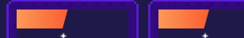

# knowledgepoint

记录前端知识点

# HTML 篇

[HTML5 语义化标签](https://rainylog.com/post/ife-note-1/)

> 百度 ife 的 h5 语义化文章，讲得很好，推荐阅读

# CSS 篇

> 总结工作中常用的 CSS 如三角形，图形结合，阴影效果，一行省略，多行省略

## CSS 三角形

```CSS
.triangle{
    width: 0;
    border-width: 10px 20px;
    border-style: solid;
    border-color: #000 transparent transparent transparent; /*倒三角*/
}
.triangle{
    width: 0;
    border-width: 10px 20px;
    border-style: solid;
    border-color: transparent #000 transparent transparent; /*右三角*/
}
.triangle{
    width: 0;
    border-width: 10px 20px;
    border-style: solid;
    border-color: transparent transparent #000 transparent; /*正三角*/
}
.triangle{
    width: 0;
    border-width: 10px 20px;
    border-style: solid;
    border-color: transparent transparent transparent #000; /*左三角*/
}
```
## 用CSS的clip-path实现不规则矩形
```CSS
.discount-btn{
    width:129px;
    height:48px;
    background: linear-gradient(90deg, #ffa25e 0%, #fd6930 100%);
    clip-path: polygon(0 0,100% 0%,75% 100%,0% 100%); // 上 x,y 右 x,y 下 x,y 左 x,y
}
```
[clip-path](https://developer.mozilla.org/zh-CN/docs/Web/CSS/clip-path)
> polygon
> 每一对在列表中的参数都代表了多边形顶点的坐标， xi 与 yi ，i代表顶点的编号，即，第i个顶点


# 关于事件冒泡和事件捕获

> 参考 [你真的了解事件冒泡和事件捕获吗？](https://juejin.cn/post/6844904115428917255)
