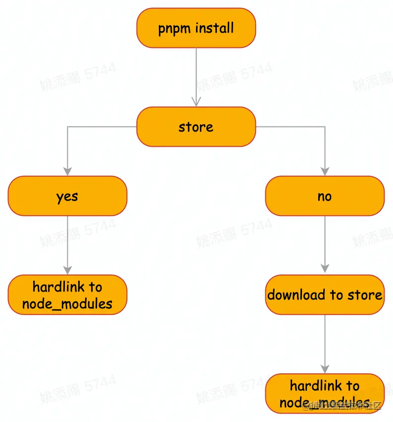

## 前言

对比npm、yarn、pnpm，以及它们都解决了哪些痛点？

## 为什么需要包管理器？

一个完成的项目或多或少有用到一些依赖，这些依赖是别人为了解决了一些问题而写好的代码（即第三方库），而这些依赖有可能一会用到第三方库来实现功能。那么为什么不自己造轮子呢？因为相对没那么可靠，第三方库是经过多方测试、兼容性和健壮性都比自己写的好。那么当依赖升级的时候，令人头疼的版本管理就出现了，包管理器的出现也解决了这些问题。

它提供方法给你安装依赖(即安装一个包)，管理包的存储位置，而且你可以发布自己写的包。


## npm早起版本（v1-v2）
早期的npm包管理器文件结构：


这样的文件结构会造就以下几点问题：
- node_modules包过大（大量重复包被安装在项目中）
- 依赖的文件路径太长（嵌套太深）
- 模块实例不能共享

## yarn & npm v3
扁平化的文件结构


扁平化的文件结构很好处理了依赖的文件路径太长（嵌套太深）的问题，因为所有的依赖都被放在了node_modules目录下
在执行install命令的时候如果发现有些依赖已经被装过了就不会装了，这样也解决了大量包被重复安装的问题

但扁平化又带来了新的问题
- 幽灵依赖（即package.json只声明A的依赖，但是因为扁平化的管理，B-F因为A依赖到到了它们所以被放在了与A相同的层级，理论上我们只可以使用A但实际上我们还可以使用B-F）这样会造成B-F升级版本后项目可能会出现问题并且排查相对困难
- 扁平化算法本身复杂性高，耗时过长
- 依赖结构的不确定性

**依赖结构的不确定性举例**
假如B和C都依赖了D，但是依赖的版本不一样，B依赖D@1.0，C依赖D@2.0，具体的版本是package.json声明顺序决定的，后面声明的会覆盖前面的依赖

## pnpm

pnmp是一个兼容npm的JavaScript包管理工具，它在依赖安装速度和磁盘空间利用方面都有显著的改进。它与 npm/yarn 非常相似，它们都是使用相同的 package.json 文件管理依赖项，同时也会像 npm/yarn 利用锁文件去确保跨多台机器时保证依赖版本的一致性。

pnpm安装的依赖都存储在~/.pnpm-store 目录下，只要同一台机器，下次安装依赖的时候pnpm会先检查store目录，如果有你需要的依赖则会通过一个硬链接丢到到你的项目中去，而不是重新安装依赖。

使用 pnpm 安装，pnpm 会将依赖存储在 store 目录下。这个目录其实起到了很关键的作用，它所解决的是多个 项目之间已经安装过的包不能共享与每次安装依赖都会重新安装的问题， 这样对于已经安装过的包能够直接在多个项目之间重复使用，而不是像 npm/yarn 每次都是去重新安装他们


**那pnpm是如何进行依赖复用和共享依赖的呢？**

在这之前先了解两个概念：
- 硬链接（hard link）
- 软连接（soft link）又称符号链接（symbolic link）

**inode**

每一个文件都有一个唯一的 inode，它包含文件的元信息，在访问文件时，对应的元信息会被 copy 到内存去实现文件的访问。

**hard link**

硬链接可以简单理解为一个相互的指针，创建的hard link 指向源文件的inode，系统不需要重新分配inode

硬链接不管有多少个，都指向的是同一个 inode 节点，这意味着当你修改源文件或者链接文件的时候，都会做同步的修改。

**soft link**
软链接可以理解为是一个单向指针，是一个独立的文件且拥有独立的 inode，永远指向源文件，这就类比于 Windows 系统的快捷方式。

**hard link 机制**
使用 pnpm 安装，pnpm 会在全局的 store 目录里存储项目的依赖，这点在上我们已经说过了。假设有这么一个情景，我拿到了一个新的项目，正准备安装项目所需要的依赖。pnpm 会这么做，如果 store 目录里面拥有即将需要下载的依赖，下载将会跳过，会向对应项目 node_modules 中去建立硬链接，并非去重新安装它。这里就表明为什么 pnpm 性能这么突出了，最大程度节省了时间消耗和磁盘空间。




**创建非扁平的 node_modules 目录**


里面每个包的每个文件都是node_modules到内容可寻址存储的硬链接。假设您安装foo@1.0.0依赖于 bar@1.0.0. pnpm 会node_modules像这样硬链接这两个包
```js
node_modules
└── .pnpm
    ├── bar@1.0.0
    │   └── node_modules
    │       └── bar -> <store>/bar
    │           ├── index.js
    │           └── package.json
    └── foo@1.0.0
        └── node_modules
            └── foo -> <store>/foo
                ├── index.js
                └── package.json
```
这些是node_modules. 一旦所有包都硬链接到node_modules，就会创建符号链接以构建嵌套的依赖关系图结构。

安装的下一阶段是符号链接依赖项。bar将符号链接到foo@1.0.0/node_modules文件夹：
```js
node_modules
└── .pnpm
    ├── bar@1.0.0
    │   └── node_modules
    │       └── bar -> <store>/bar
    └── foo@1.0.0
        └── node_modules
            ├── foo -> <store>/foo
            └── bar -> ../../bar@1.0.0/node_modules/bar
```
接下来，处理直接依赖关系。foo将被符号链接到根node_modules文件夹中，因为foo它是项目的依赖项
```js
node_modules
├── foo -> ./.pnpm/foo@1.0.0/node_modules/foo
└── .pnpm
    ├── bar@1.0.0
    │   └── node_modules
    │       └── bar -> <store>/bar
    └── foo@1.0.0
        └── node_modules
            ├── foo -> <store>/foo
            └── bar -> ../../bar@1.0.0/node_modules/bar
```
这样就有效的避免了幽灵依赖的缺点。