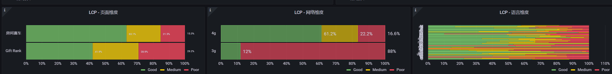

## 前言

核心Web指标：
- LCP
- FID
- CLS

## LCP
Largest Contentful Paint (LCP) ：最大内容绘制 (LCP) 指标会根据页面首次开始加载的时间点来报告可视区域内可见的最大图像或文本块完成渲染的相对时间。


如上图所示：为了提供良好的用户体验，页面应该将最大内容绘制控制在2.5 秒或以内，。为了确保您能够在大部分用户的访问期间达成建议目标值，一个良好的测量阈值为页面加载的第 75 个百分位数。

## 如何测量

使用performanceObserver来监听largest-contentful-paint条目
```js
new PerformanceObserver((entryList) => {
  for (const entry of entryList.getEntries()) {
    console.log('LCP candidate:', entry.startTime, entry);
  }
}).observe({type: 'largest-contentful-paint', buffered: true});
```
每条记录在案的largest-contentful-paint条目代表当前的 LCP 候选对象。通常情况下，最近条目发射的startTime值就是 LCP 值。

或者使用web-vitals库获取测量的LCP值
```js
import {getLCP} from 'web-vitals';

// 当 LCP 可用时立即进行测量和记录。
getLCP(({value:lcp}) => {
    // 上报
});
```

可以上报用户真实的网络环境、系统语言并已柱状图的形式来观察页面的性能
如：


这样可视化的图更直观的页面的性能是否是在一个良好的水平

参考链接：[webDev](https://web.dev/lcp/)


