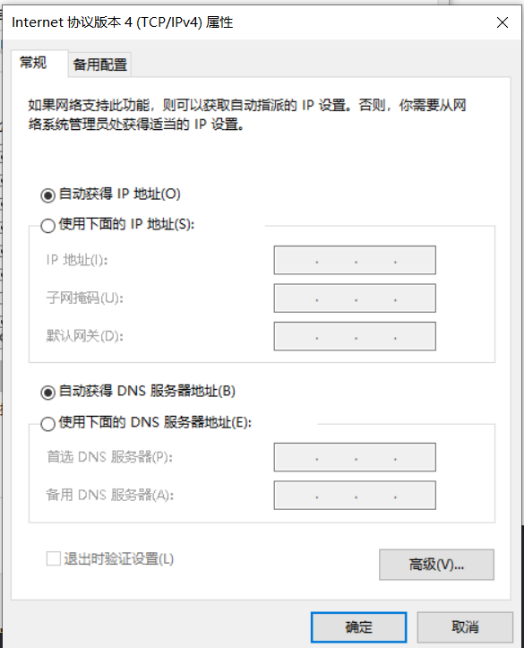

### DNS是什么
DNS（Domain Name System）服务是一个位于应用层的协议，主要的作用就是提供域名到IP地址之间的解析服务。

域名由三部分组成，以https://www.baidu.com：
> https：协议名称
> www.baidu.com.才是域名

- 根域名：com.后面的.为根域名
- 顶级域名：.com，常见的顶级域名后缀有 .com、.cn、.net、.org 等，这些都是固定的，用户不能自己修改，只能选择。
- 权威域名：.baidu。这个权威域名就是我们自己可注册的域名
- www 是指主机名

### 简述DNS解析过程

已访问https://www.baidu.com为例：
- 当在浏览器输入这个地址后，首先会在浏览器的dns缓存中查找是否有记录，如果有直接命中返回IP地址完成解析。
- 如果没有缓存就会查询操作系统的缓存，如果有直接命中返回IP地址完成解析。
- 如果操作系统缓存也没有相应记录，就会查找本地的hosts缓存文件是否有这个url地址的IP映射
- 如果本地hosts缓存文件没有就需要求助于本地 dns 服务器了，所以应该要知道本地 dns 的 ip 地址。
- 本地的DNS服务器的IP地址一般都是由本地服务商（移动、电信、联通）DHCP自动分配。

- 如果本地域名服务器查找本地缓存后，如果有对应的IP映射会直接返回对应映射
- 如果没有本地域名服务器没有对应的IP映射，**本地域名服务器**会向**根域名服务器**发出请求

> 每一级的域名服务器只保留下一级域名服务器的IP地址。比如根域名服务器只保留了顶级域名服务器的IP地址
- 根域名接收到请求后会先判断该请求的域名是属于哪个顶级域名，判断完成后并返回一个该顶级域名的IP，本地的DNS服务器收到后会向.com这台顶级域名服务器发出请求。
- 如果该.com顶级域名服务器还找不到对应的IP映射，则会返回下一级域名服务器的IP（权威），本地DNS服务器拿到IP后会联系权威域名服务器（.baidu）。
- 找到后会将对应www.baidu.com的IP地址给到本地DNS服务器，从而得到一个ip地址和域名的对应关系，并存储在缓存文件中。
- 如果经过DNS递归查询之后仍找不到对应的IP映射，则报错，表示无法查询到所需的IP地址。