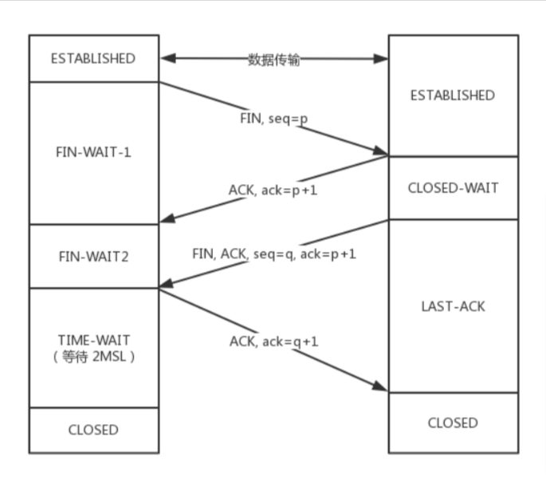

## TCP的四次挥手

先看图解四次挥手过程

- 刚开始处**ESTABLISHED（传输状态）**
- **第一次挥手：** 当客户端想要关闭连接时，就会发送指令 **（FIN）** 给服务器，**并停止再发送数据**，此时客户端处于 FIN_WAIT1 状态，等待服务端的确认。
- **第二次挥手：** 服务器接收到指令后会发送 ACK 报文，且把客户端的序号值 +1 作为 ACK 报文的序列号值，表明已经收到客户端的报文了，此时服务端处于 CLOSE_WAIT 状态。
- 这个是双方的状态是 客户端已经关闭了发送数据的功能但是可以接收，而服务端仍然可以发送和接收
- **第三次挥手：** 等发送完所有数据后，服务器会发送**FIN**并指定一个序列号seq=q，然后进入**LAST-ACK**状态
- **第四次挥手：** 客户端收到服务端发来的FIN后，自己变成了**TIME-WAIT**状态，然后发送 **ACK报文（ack = q + 1）** 作为应答。
- 注意了，这个时候，客户端需要等待足够长的时间，具体来说，是 **2个MSL(Maximum Segment Lifetime，报文最大生存时间)**, 在这段时间内如果客户端没有收到服务端的重发请求，那么表示 ACK 成功到达，挥手结束，否则客户端重发 ACK。

### 为什么要等待2个MSL？

答：这样做的目的是确保服务端收到自己的 ACK 报文。如果服务端在规定时间内没有收到客户端发来的 ACK 报文的话，服务端会重新发送 FIN 报文给客户端，客户端再次收到 FIN 报文之后，就知道之前的 ACK 报文丢失了，然后再次发送 ACK 报文给服务端）。服务端收到 ACK 报文之后，就关闭连接了，处于 **CLOSED** 状态。

### 为什么要四次挥手？三次行不行？
答：由于TCP通信的双端都具有**发送的能力**和**接收的能力**。所以需要确认双方的**发送的能力**和**接收的能力**都关闭连接。
任何一方都可以在数据传送结束后发出连接释放的通知，待对方确认后进入半关闭状态。当另一方也没有数据再发送的时候，则发出连接释放通知，对方确认后就完全关闭了TCP连接。
**两次握手就可以释放一端到另一端的 TCP 连接，完全释放连接一共需要四次握手。**

**如果是三次挥手会有什么问题？**

等于说服务端将ACK和FIN的发送合并为一次挥手，这个时候长时间的延迟可能会导致客户端误以为FIN没有到达客户端，从而让客户端不断的重发FIN。