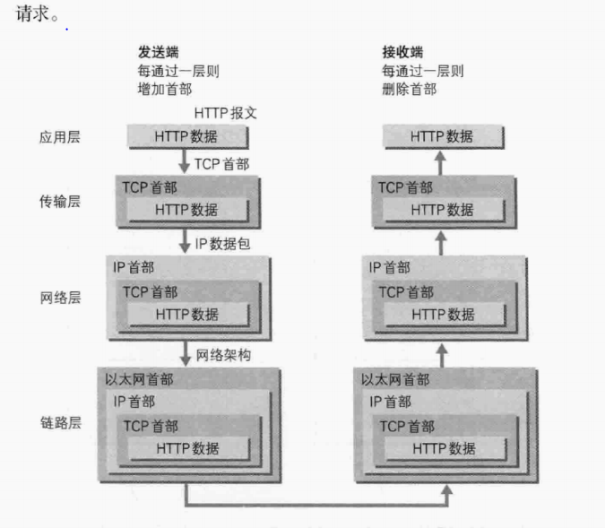
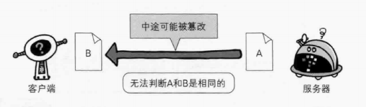
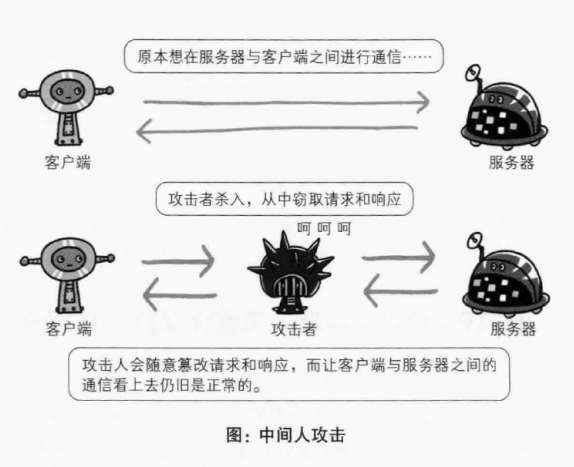
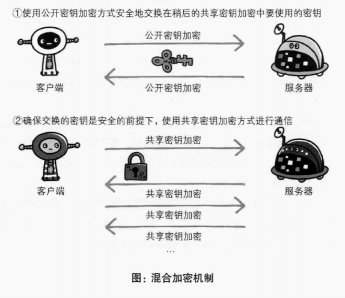
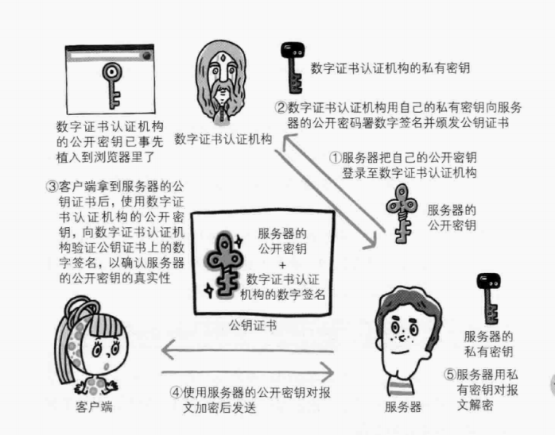

## 为什么需要HTTPS？

我们知道HTTP协议是使用明文传输的。所以在HTTP协议中有可能会出现信息窃听或者身份伪装等安全问题，而使用HTTPS通信机制可以有效防止这些问题。

## HTTP的缺点

HTTP协议的传输主要由以下缺点：

> - 通信使用明文（不加密），内容可能会被窃听
> - 不验证通信方身份，可能遭遇伪装
> - 无法证明报文的完整性，所以有可能被篡改

这些问题在其他未加密的协议中也都会体现。

### 通信使用明文有可能会被窃听

为什么说使用明文的方式传输是个缺点呢？这是因为，按TCP/IP的工作机制进行通信时，传输的数据都会经过应用层、传输层、网络层、链路层，TCP/IP的工作机制进如下图：

由图中可知，每一层都会给数据加上该层独特的标识，然后经过路由器、运营商、目标服务器，在这些环境中主需要收集互联网上流动的数据包就可以窃听请求中的数据了，常见的抓包工具Wireshark，它可以获得HTTP协议的请求和相应的内容，并对其进行解析。

Wireshark抓包示例图：

#### 由于HTTP协议中没有加密机制，那么如何对HTTP进行加密呢？

> - SSL
> - 对内容进行加密

通过**SSL**(Secure Socket Layer 安全套接层)或 **TLS**（Transport Layer Security 安全传输协议)的组合使用，加密HTTP的通信内容。

这种方式是建立一条**安全的通信线路**使HTTP可以在这条线路上进行通信，这种与**SSL组合**使用的加密方式称为**HTTPS**

**内容的加密：顾名思义就是对数据内容本身进行加密，即把HTTP报文里所含内容进行加密处理，这种方式要求客户端和服务器都需要具有加密和解密的机制**

### 不验证通信方身份，可能遭遇伪装

HTTP协议中的请求和响应不会对通信方进行身份验证，就是存在**服务器是否是客户端发起请求URL中的真正指定的主机，返回的响应是否真的返回到实际发起请求的客户端**的问题。

所以SSL使用了一种被称为证书的手段来确定通信方。

**证书**由值得信赖的第三方机构颁发，用以证明服务器和客户端是实际存在的。只要能够确定（服务器和客户端）通信方的持有的证书即可确定双方身份。

### 无法证明报文的完整性，所以有可能被篡改

完整性就是信息的准确度，无法证明报文的完成性就是无法确定信息的是否准确。

**接受到的内容可能有误**

由于HTTP协议无法证明通信报文的准确性，因此，在请求或响应后到对方接受之前的这段时间，请求或响应的内容有可能会被篡改，并且无法知悉。

比如，从某个web网站下载内容，客户端接收到的内容是无法确定是否与服务器存放的内容是一致的。文件内容有可能在传输过程中被第三方篡改，而客户端是无法得知内容是否被篡改的。这种行为被成为中间人攻击（Man-in-the-Middle-attack,MITM）。

 

### HTTP + 加密 + 认证 + 完整性 = HTTPS

#### 加密
> 对称加密（共享密钥）
> 非对称加密 （公开密钥）

**对成加密：** 加密和解密都用同一个密钥，这样带来的好处就是加解密效率很快，但是并不安全。
**非对称加密：** 一把公开密钥（public key），一把私有密钥（private key）。顾名思义公开密钥可以随意发布给他人，私有密钥不能让其他人知道。效率慢

使用非对称加密方式，发送密文的一方使用对方发布的公开密钥进行加密，对方收到加密的信息后，在使用自己的私钥进行加密。

**混合加密：** HTTPS采用对称加密和非对称加密两者合并并用的混合加密机制。

 

#### 数字认证

 

**在客户端第一次给服务端发送HTTPS请求的时候，服务端会将它自己的证书随着其它的信息(例如server_random、 server_params、需要使用的加密套件等东西)一起返给客户端。**

所以数字证书认证就能够保证HTTP通信方的身份和报文的完整性。

