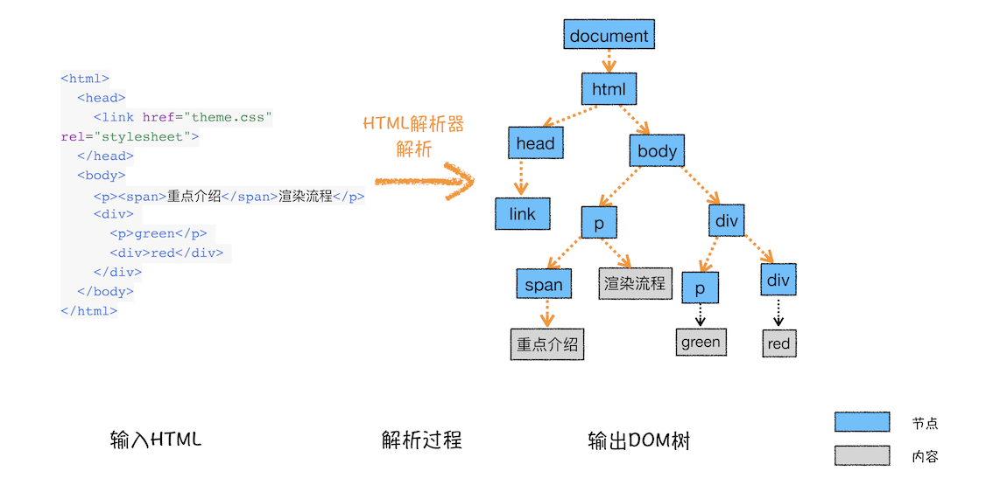
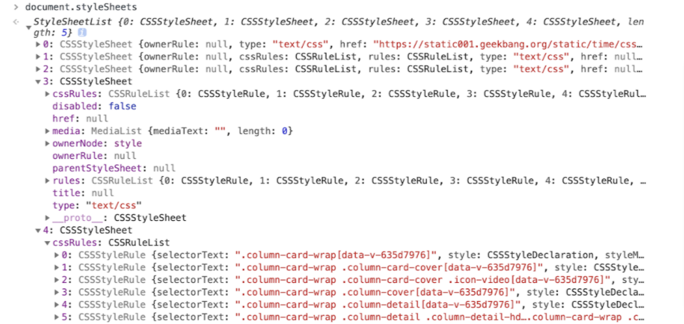
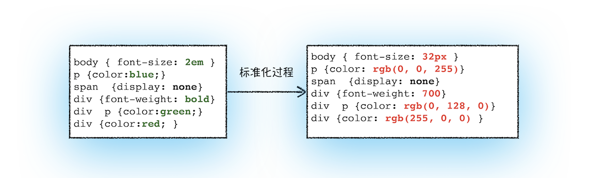
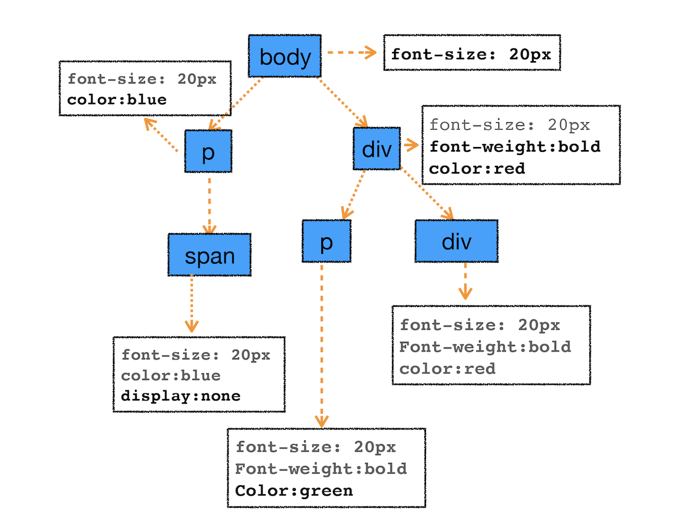

## 前言
> 当服务器返回渲染文件(HTML/CSS/JS)，浏览器是读不懂这些文件的(臣妾做不到啊！！！)
> 必须经过一系列的转化过程:
> - 构建DOM树
> - 样式计算
> - 布局
> - 构建、绘制图层
> - 栅格化（raster）
> - 合成


## 构建DOM树

构建DOM树的目的就是将HTML文件的内容构建成浏览器能够理解的树结构



## 样式计算
生成DOM树之后,就要将CSS文件、内联样式、style标记里的样式转化为浏览器可以理解的结构——**styleSheets(可以在Chrome控制台中查看其结构，只需要在控制台中输入document.styleSheets)**



除了转化为**styleSheets**结构还需要转换样式表中的属性值，使其标准化
标准化的意思就是像一些rem，em需要根据对应的字体大小进行等值转换，比如一些颜色值，将会转换成RGB的格式



然后将标准化的**styleSheet**结合到DOM树上,也就是计算DOM树中每个节点的样式属性了。

**这里涉及到CSS的继承规则和层叠规则**

继承简单的理解就是子节点继承父节点的样式
可以想象一下这样一张样式表是如何应用到DOM节点上的。
```css
body { font-size: 20px }
p {color:blue;}
span  {display: none}
div {font-weight: bold;color:red}
div  p {color:green;}
```
合到上面的DOM树上计算出来的每个节点的具体样式为：

样式计算过程中，会根据DOM节点的继承关系来合理计算节点样式